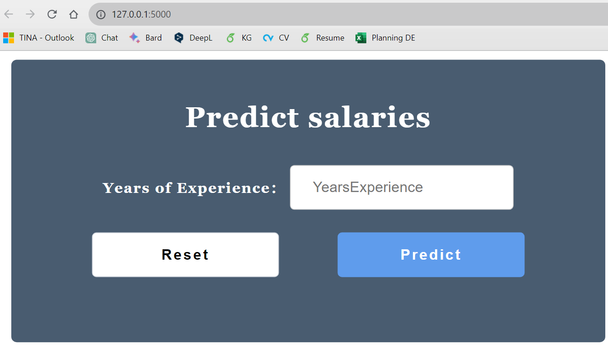

# Salary-prediction-flask-app

*Screenshot of the application before prediction.*

*Screenshot of the application after prediction.*

## Description
This is a simple web application that predicts salary based on years of experience using a linear regression model. You just need to input the number of years of experience, and the application will provide you with an estimated salary.

## Features
- Salary prediction based on years of experience.
- User-friendly interface.

## Usage
1. Clone this repository: `git clone https://github.com/your-username/salary-prediction-app.git`
2. Navigate to the project directory: `cd salary-prediction-app`
3. Create a virtual environment: `python -m venv venv`
4. Activate the virtual environment:
   - On Windows: `venv\Scripts\activate`
   - On macOS and Linux: `source venv/bin/activate`
5. Install the dependencies: `pip install -r requirements.txt`
6. Run the application: `python app.py`
7. Open your web browser and access the following URL: `http://localhost:8080`

## Prerequisites
- Python 3.x
- A modern web browser

## Author
[TINA Djara Olivier]

## License
This project is licensed under the [insert your chosen license].
